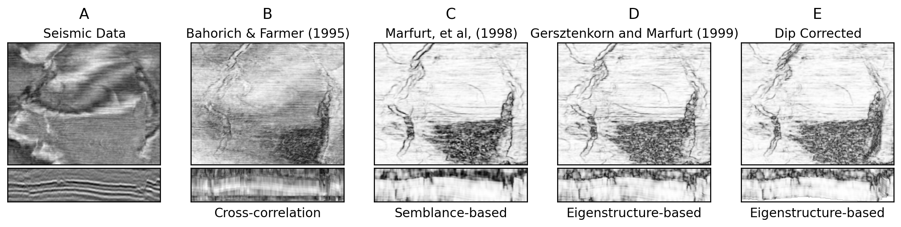
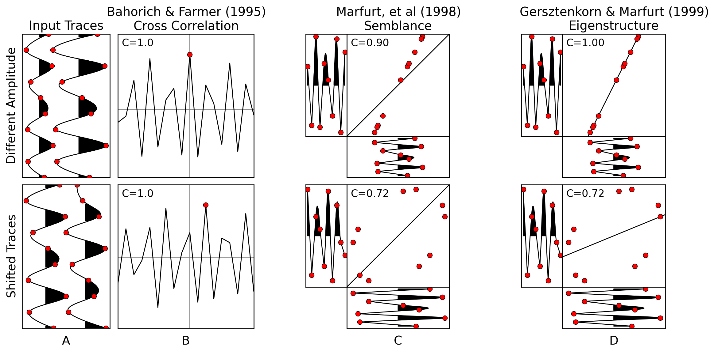

Semblance, Coherence, and other Discontinuity Attributes
========================================================
by Joe Kington, Chevron <joe.kington@chevron.com>

Discontinuity calculations, also called coherence or semblance, are some of the most commonly used seismic attributes. They measure the amount of similarity between adjacent seismic traces. However, there are several different types of discontinuity estimates and a plethora of names for similar attributes. As a result, it can be difficult to understand the differences between them. While the discontinuity algorithm that any particular software package uses may be unknown, most are based on one of a few published methods.  Understanding published discontinuity attributes gives insight into the trade-offs between different proprietary implementations. Therefore, in this tutorial and the accompanying [Jupyter notebook](https://github.com/seg/tutorials), we'll explore simplified Python implementations of a few widely used discontinuity algorithms.


Introduction
------------

Discontinuity attributes are a variety of post-stack calculations that measure the degree of local similarity or dis-similarity between seismic traces. Discontinuities in a seismic volume, such as faults or mass transport deposits, are apparent as regions of low similarity. Therefore, discontinuity attributes are most often applied to highlight faults in a seismic volume, but are also useful to detect subtle stratigraphic features in map view. Semblance-based coherence (Marfurt et al., 1998), eigenstructure-based coherence (Gersztenkorn and Marfurt, 1999), and other discontinuity attributes are among the most widely applied seismic attributes today.

The terminology used for discontinuity attributes is often confusing. Terms such as "coherence", "semblance", "similarity", "discontinuity" and many others are used to refer to both the general class of attribute and to specific algorithms. For these reasons, in this tutorial we'll use the term "discontinuity" to refer to the general class of attribute. Specific algorithms will always include a reference in addition to the name the original author used to avoid confusion.

**NOTE FROM MATT: We could potentially cut this para if we need the space.**
In practice, most discontinuity attributes are calculated and applied in proprietary seismic interpretation packages. The exact algorithm used by a particular package is sometimes a considered a trade secret or may be undocumented. For that reason, we won't directly refer to or compare commercially available implementations in this tutorial. However, most proprietary discontinuity attributes are based on or similar to published algorithms. Therefore, understanding widely-cited published algorithms for discontinuity helps understand the trade-offs between different commercial implementations.

We'll focus on demonstrating a few of the most cited discontinuity algorithms in the literature with short Python code snippets. The data we'll be working with is a small subset of the Penobscot 3D seismic dataset from offshore Nova Scotia, owned by the Nova Scotia Department of Energy and distributed by dGB Earth Sciences under a CC-BY-SA license (Nova Scotia Department of Energy, 1992) (Figure 1A). These examples eschew practical considerations (e.g. memory usage and speed) and focus on demonstrating the algorithm using high-level concepts. The accompanying [Jupyter notebook](https://github.com/seg/tutorials) expands on these examples and gives runnable versions of these short snippets.


Early Algorithms - Cross-correlation
--------------------------------
The earliest discontinuity algorithm was developed by Bahorich and Farmer (1995) and used the maximum cross-correlation value of three traces.  Each trace is correlated with a "moving-window" subset of two neighboring traces (Figures 1B and 2B). A complete implementation is given in the accompanying notebook, but we'll skip it here for brevity. Bahorich and Farmer coined the term "coherence" for the attribute, based on its conceptual similarity to pre-stack methods for estimating stacking velocities (e.g. Taner and Koehler, 1969).  While this exact approach is computationally expensive and not widely used today, it provides a starting point to understand later algorithms.


Generalization to an Arbitrary Number of Traces
-----------------------------------------------
Bahorich and Farmer's (1995) approach was very successful, but it is sensitive to noise because only three traces are used. Marfurt et al. (1998) generalized Bahorich and Farmer's cross-correlation approach to an arbitrary number of input traces, referred to by the authors as "semblance-based coherence" (Figure 1C). As an example:

```
def moving_window(data, func, window):
  wrapped = lambda x: func(x.reshape(window))
  return scipy.ndimage.generic_filter(data,
                                      wrapped,
                                      window)

def marfurt_semblance(region):
  # Stack traces in 3D region into 2D array
  region = region.reshape(-1, region.shape[-1])
  ntraces, nsamples = region.shape
  square_sums = np.sum(region, axis=0)**2
  sum_squares = np.sum(region**2, axis=0)
  c = square_sums.sum() / square_sums.sum()
  return c / ntraces

result = moving_window(seismic_data,
                       marfurt_semblance,
                       (3, 3, 9))
```

Conceptually, Marfurt et al.'s (1998) algorithm treats each seismic trace within the moving window as a separate dimension and measures how close the resulting point cloud is to a hyper-plane with a slope of 1 in all directions and intercept of 0. It's easiest to visualize for the case of two traces, as shown in Figure 2C. In that case, semblance-based coherence computes how close
the points fall to a line with a slope of 1 and intercept of 0.


Removing Amplitude Sensitivity
------------------------------

One caveat to both Marfurt et al.'s (1998) and Bahorich and Farmer's (1995) methods is that they're sensitive to lateral differences in amplitude as well as in phase. While this is desirable for detecting stratigraphic features, differences due amplitude can obscure subtle structural features. Gersztenkorn and Marfurt (1999) proposed an implementation that is sensitive only to lateral changes in phase of the input waveforms: "eigenstructure-based coherence" (Figure 1D, Figure 2D).

Eigenstructure-based coherence (Gersztenkorn and Marfurt, 1999) computes the covariance matrix of the input region, similar to the previous example. However, it uses the ratio of the largest eigenvalue of the covariance matrix to the sum of the eigenvalues:

```
def gersztenkorn(region):
  # Stack traces in 3D region into 2D array
  region = region.reshape(-1, region.shape[-1])

  # Calculate eigenvalues of covariance matrix
  cov = region.dot(region.T)
  vals = np.linalg.eigvalsh(cov)
  return vals.max() / vals.sum()

result = moving_window(seismic_data,
                       gersztenkorn,
                       (3, 3, 9))
```

Conceptually, this is similar to treating each seismic trace within the moving window as a separate dimension and calculating how well the resulting point cloud is fit by a plane. To contrast with Marfurt et al.'s (1998) method, for the case of two traces, this measures the scatter about the best-fit line instead of a line with a slope of 1, as shown in Figure 2D.


Gradient Changes Instead of Trace Similarity
--------------------------------------------

An entirely different approach than any we've discussed so far is to apply a structure tensor to seismic attributes. The structure tensor measures how the gradient of each dimension co-varies locally. Randen et al. (2000) were the first to propose this approach in their Gradient Structure Tensor (GST) attributes. A number of useful attributes can be computed from the ratios of the eigenvalues of the structure tensor, one of which is a measure of how planar the data is locally, which we'll refer to as GST coherence (Randen, et al 2000) (Figure 1E).

```
from scipy.ndimage import gaussian_filter1d

def gradients(seismic, sigma):
  grads = []
  for axis in range(3):
    grad = gaussian_filter1d(seismic, sigma,
	                         axis=axis, order=1)
    grads.append(grad[..., np.newaxis])
  return np.concatenate(grads, axis=3)

def gst_coherence_calc(region):
  region = region.reshape(-1, 3)
  gst = region.T.dot(region)
  eigs = np.sort(np.linalg.eigvalsh(gst))[::-1]
  return (eigs[0]-eigs[1]) / (eigs[0]+eigs[1])

def gst_coherence(seismic, window, sigma=1):
  grad = gradients(seismic, sigma)
  return moving_window4d(grad_array,
                         window,
                         gst_coherence_calc)
```

Because GST coherence measures change in the local slope of the data, it is more closely related to curvature attributes than to the other discontinuity attributes we've discussed (Randen et al., 2000; Chopra and Marfurt, 2007). Therefore, it can reveal different features than discontinuity attributes that compare waveform similarity, but tends to show thicker regions of discontinuity around faults (Chopra and Marfurt 2007) (Figure 1E).


Final Thoughts
--------------

Discontinuity attributes are a fundamental part of an interpreter's toolkit when working with 3D data. While most interpreters are familiar with using discontinuity attributes, few are familiar with how they're implemented or the differences between similar attributes. Hopefully the accompanying Jupyter notebook and this brief tutorial helps clear up some implementation details and inspires you to attempt new variants on well-known discontinuity attributes.


References
----------

Bahorich, M., and S. Farmer, 1995, 3-D seismic discontinuity for faults and stratigraphic features: The coherence cube: The Leading Edge, **14**, 1053-1058. doi:10.1190/1.1437077 

Chopra, S., and K. J. Marfurt, 2007, Seismic Attributes for Prospect Identification and Reservoir Characterization: **SEG** doi:10.1190/1.9781560801900

Gersztenkorn, A., and K. J. Marfurt, 1999, Eigenstructure‐based coherence computations as an aid to 3-D structural and stratigraphic mapping: GEOPHYSICS, **64**, 1468-1479. doi:10.1190/1.1444651 

Marfurt, K., V. Sudhaker, A. Gersztenkorn, K. D. Crawford, and S. E. Nissen, 1999, Coherency calculations in the presence of structural dip: GEOPHYSICS, **64**, 104-111. doi:10.1190/1.1444508

Marfurt, K. J., 2006, Robust estimates of 3D reflector dip and azimuth: GEOPHYSICS, **71**, no. 4, P29-P40. doi:10.1190/1.2213049

Nova Scotia Department of Energy, 1992, Penobscot 3D Survey. Dataset accessed 19 October, 2015 at
https://opendtect.org/osr/pmwiki.php/Main/PENOBSCOT3DSABLEISLAND

Randen, T., E. Monsen, C. Singe, A. Abrahamsen, J. Hansen, T. Saeter, and J. Schlaf, 2000, Three-dimensional texture attributes for seismic data analysis, 70th Annual International Meeting, **SEG**, Expanded Abstracts, 668-671.

Taner, M. T., And F. Koehler, 1969, Velocity Spectra—Digital Computer Derivation Applications of Velocity Functions: Geophysics, **34**, 859-881. d
oi:10.1190/1.1440058 

Figures
-------



**Figure 1**: A comparison of the discontinuity algorithms discussed using the Penebscot 3D seismic dataset (Nova Scotia Department of Energy, 1992).




**Figure 2**: A visual explanation of the differences between the discontinuity algorithms discussed using only two traces. "C" indicates the calculated coherence value.
